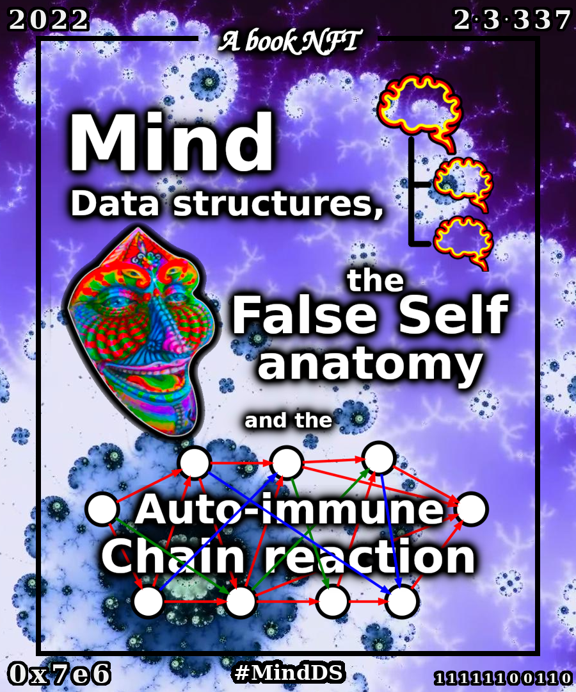

# Mind Data Structures, the False Self Anatomy and the Auto-Immune Chain Reaction

Cardano Minting Policy Id: `1bf426595cb6d02e2cd0ef2ed94ca8b8d9d91bcc6e15d9e7c4638b30`
Hashtag : `#MindDS`

"Mind Data Structures, the False Self Anatomy and the AutoImmune Chain Reaction" is the result of a project with 2 different aspects.

On one hand it is a book proposing a point of view with some basics to talk about the mind, to build a better understanding of its working and role and to apreciate the very confusing and distractive structures that can appear. This understanding has the intensions to lead to a better society. The book is available in this page under the name `book.pdf`.

On the other hand, it is a Non Fungible Token (NFT) collection on the Cardano Network. Each NFT contains the book previously mentioned plus a unique cover for the book.

In this README there will be an overview of the two aspects, first the artistic NFT collection aspect, then the conceptual book content aspect.

# Youtube Videos
NFT aspect Explanation: https://youtu.be/XzrXipTPLcI

# NFT Aspect

Each NFT is composed of a PDF File containing the book, and the cover image for that book.

The cover image is composed of the following elements:
- A set of common graphical elements that include the title, a border, and decorative images.
	- For "Mind Data Structures" there are 3 icons representing brains (or minds), organised in what it looks like a folder with two files inside.
	- For "The False Self Anatomy", there is a colourful mask.
	- For the "Auto-immune chain reaction" there are some nodes connected by arrows, representing a chain reaction arround the text.
- A unique background with a specific location, and zoom level on a Mandelbrot Fractal. All the images are from the same location, but different zoom levels. Those images were extracted from a youtube video, and the corresponding credits to the creator should be given.
- A unique number for each cover. From that number, 4 graphical representations of that number are injected in the image, namely the decimal repesentation, the prime decomposition (in decimal representation also), the hexadecimal representation, and the binary representation. In positions top-left, top-right, bottom-left, bottom-right, respectively.
- If that number has some specific features, some decorations are added to the image for the cover.
	- if the number belongs to one of the following category, a decoration corresponding to that category has been added to the image. If a number belongs to more than one category, the most scarce category prevails: catalan numbers, fermat prime numbers, perfect numbers, mersenne prime numbers, power of prime numbers, triangular numbers, palindrome numbers, twin prime numbers, prime numbers, factorial numbers and angel numbers.
	- if the number belongs to the fibonacci sequence, there are some spirals decorating the lower part of the cover (independently of the categories mentioned above).
	- for the first 905 numbers, an associated pokemon is added to the image in the bottom right part. It is the mascotte for the holder of the NFT.

## How to Buy an NFT

The NFTs are being listed in https://jpg.store , https://cnft.io and maybe others. Be sure to check that the policy ID of the NFT is `82315ca6413d7aff8d5fe00d991c13fe5a211ecad7121850206d6a8a`. The NFT will be exhanged by Ada, that is the crypto currency of the Cardano Network, available in most crypto exchanges.

https://cnft.io/project/mind-data-structures
https://jpg.store/collections/1bf426595cb6d02e2cd0ef2ed94ca8b8d9d91bcc6e15d9e7c4638b30

To buy the NFT with your computer, you will need to download a browser extension wallet (I recommend Etrnl - ccvault for chrome or brave browser), fund that wallet, and connect it to the marketplace where you found the NFT.

From an Android phone, you can do that entering the stores through the Etrnl app.

From an Iphone I assume that the procedure is similar.

Once you hold the NFT, you can move it to other accounts or list it in other sites at the price you want. It is now yours!

# Book Aspect
The book and the book's description will soon be available!
